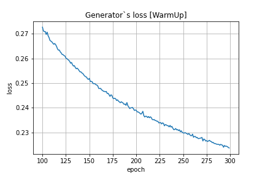
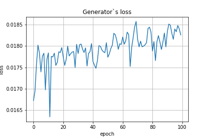
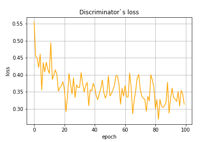
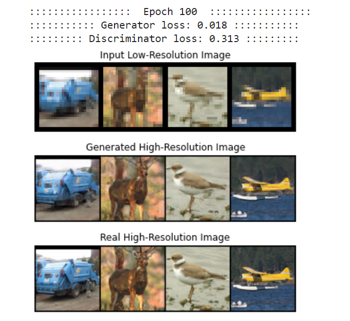

Super-Resolution GAN
======================

:star: Star this project on GitHub — it helps!

[Super-Resolution GAN](https://arxiv.org/abs/1609.04802) is one of the best examples in GAN's application. It allows
to imporove the quality of input low-resolution image. As **Generator** this GAN uses
**SRResNet** (Super-Resolution Residual Network). In order to provide better quality of
the output image the network is trained on three different loss functions.

## Table of content

- [Evaluation](#eval)
    - [TER](#typo3-extension-repository)
- [Training](#train)
    - [Database](#database)
    - [WarmUp of Generator](#warmup)
    - [Training with Discriminator](#train)
- [License](#license)
- [Links](#links)

## Evaluation

This document is for the latest Aimeos TYPO3 **20.10 release and later**.

- LTS release: 20.10 (TYPO3 9/10 LTS)
- Beta release: 2021.01 (TYPO3 9/10 LTS)

### Training

#### Database

The Super-Resolution GAN was trained on **STL10** dataset from `torchvision.dataset`.

#### WarmUp of Generator

Before to train both **Generator** and **Discriminator** we should pretrain our **Ganarator** on
dataset with **Pixel-wise Loss** function.

#### Training with Discriminator

After **Generator** warmup we train booth **Generator** and **Discriminator** with their loss functions.
The **Generator loss** consists of **Adverserial loss**(BCE loss between *fake prediction and target*),
**Model Based loss**(feature based MSE loss between *fake and real images*) and **Pixel-wise loss**(MSE loss between *fake and real images*).

**Training after 100 epochs**

## License

The Aimeos TYPO3 extension is licensed under the terms of the GPL Open Source
license and is available for free.

## Links

* [Web site](https://aimeos.org/integrations/typo3-shop-extension/)
* [Documentation](https://aimeos.org/docs/TYPO3)
* [Forum](https://aimeos.org/help/typo3-extension-f16/)
* [Issue tracker](https://github.com/aimeos/aimeos-typo3/issues)
* [Source code](https://github.com/aimeos/aimeos-typo3)
